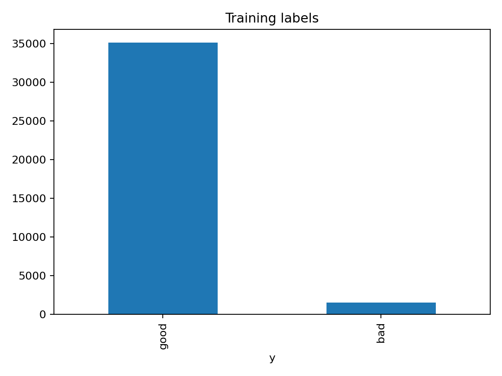
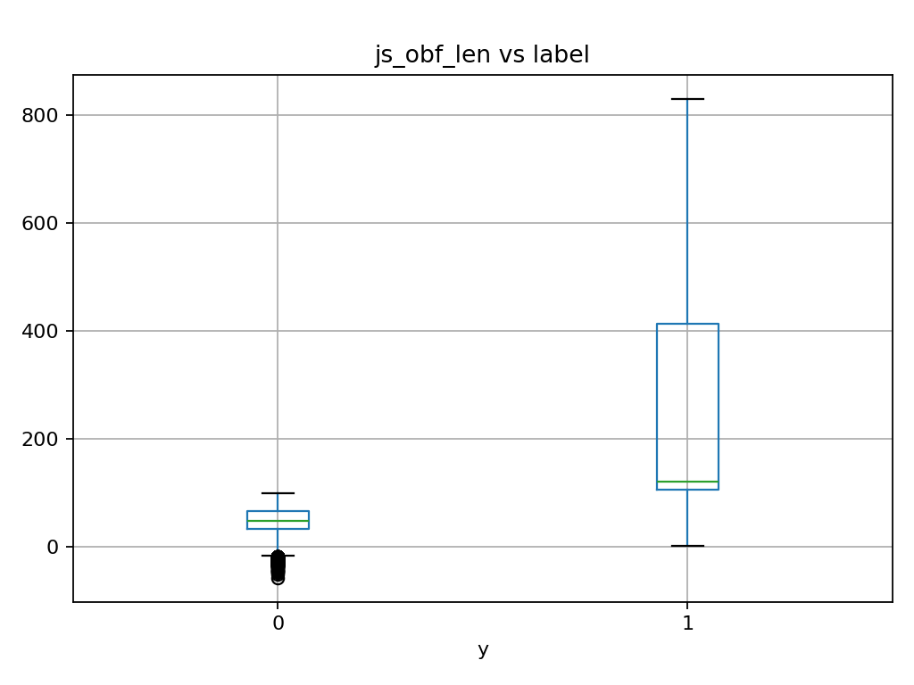

# Malicious Website Detector

## Screenshots





## Project Overview


Malicious Website Detector is a machine learning project built in Python that identifies potentially malicious websites based on website metadata and behavioral indicators. The application applies business rules, performs data preprocessing, and uses predictive modeling to classify websites as either safe or malicious.


\## Features


\* Exploratory data analysis (EDA)

\* Data visualization using Matplotlib

\* Business rule implementation

\* Website risk classification

\* Logistic Regression model

\* Random Forest model

\* Threshold optimization based on business cost

\* Prediction generation for unlabeled websites

\* Automated results reporting


\## Technologies Used


\* Python

\* Pandas

\* NumPy

\* Scikit-Learn

\* Matplotlib

\* Random Forest

\* Logistic Regression

\* Data Preprocessing

\* Machine Learning


\## What I Learned


This project helped me gain experience with:


\* Machine learning model development

\* Data cleaning and preprocessing

\* Feature engineering

\* Classification algorithms

\* Exploratory data analysis

\* Business-driven decision making

\* Cybersecurity risk assessment

\* Data visualization and reporting


\## Project Results


The Random Forest model produced the best results for detecting malicious websites.


\* Optimal Threshold: 0.13

\* True Negatives: 7018

\* False Positives: 2

\* False Negatives: 7

\* True Positives: 298

\* Total Business Cost: $7,100


The lower threshold was selected to reduce the risk of missing malicious websites, which carried a significantly higher business cost than incorrectly flagging safe websites.


\## Business Rules Implemented


\* Websites younger than 100 days had registered domain information replaced with "Unknown"

\* Websites with a JavaScript obfuscation length greater than 100 were automatically classified as malicious


\## How To Run


Install the required packages:


```bash

pip install pandas numpy matplotlib scikit-learn

```


Run the application:


```bash

python malicious\_website\_detector.py

```


\## Project Structure


```text

malicious\_website\_detector.py

README.md

results\_summary.txt

labels.png

js\_obf\_len\_box.png

```


\## Future Improvements


\* Additional classification models

\* Real-time website scanning

\* Web-based dashboard for analysis

\* Automated feature selection

\* Model performance monitoring

\* Integration with threat intelligence feeds


